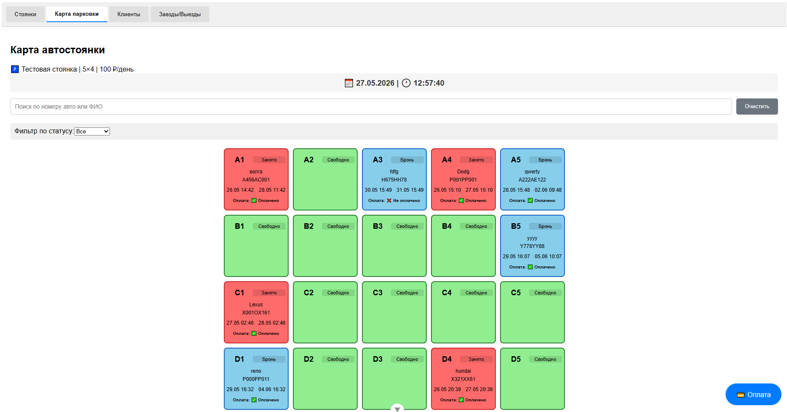
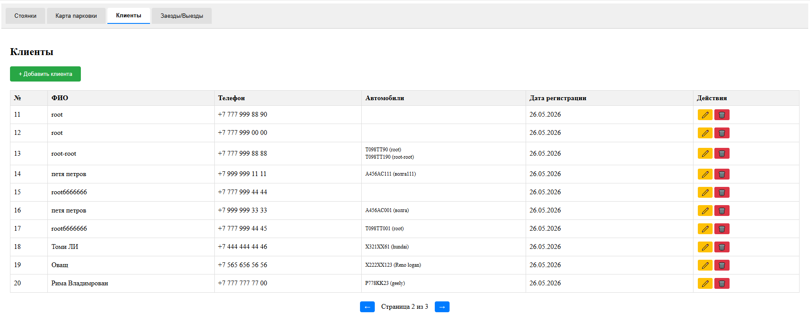
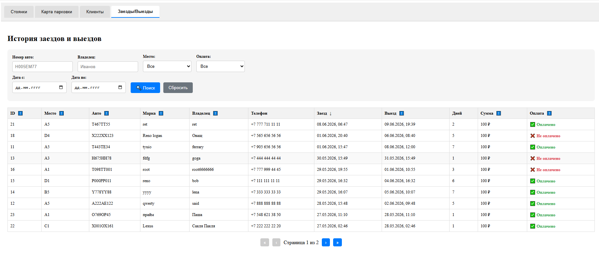
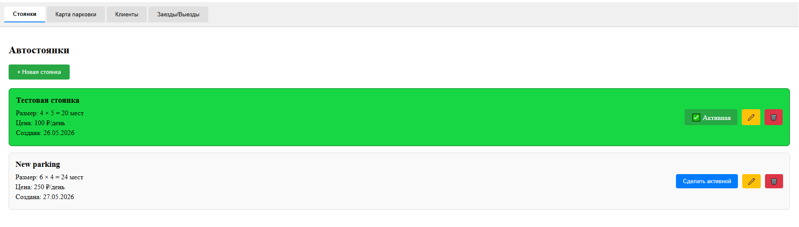

# 📁 Фронтенд: `parking-frontend`

```markdown
# 🅿️ Parking Frontend - Автостоянка (клиентская часть)

Веб-интерфейс для управления автостоянкой. Позволяет визуально управлять парковочными местами, вести учёт клиентов и автомобилей, отслеживать историю заездов и выездов.

## 📋 Требования

- Node.js 20+
- npm 10+
- Бэкенд-сервис (см. [parking-backend](https://github.com/test80git/parking-backend))

## 🚀 Быстрый старт

```bash
# Клонировать репозиторий
git clone https://github.com/test80git/parking-frontend.git
cd parking-frontend

# Установить зависимости
npm install

# Запустить в режиме разработки
npm run dev
```

Приложение будет доступно по адресу: `http://localhost:5173`

## 🏗️ Сборка для production

```bash
npm run build
```

## 🛠️ Технологии

| Технология | Версия | Назначение |
|------------|--------|------------|
| Vue | 3.x | Фреймворк |
| Vite | 8.x | Сборщик |
| Pinia | 2.x | Управление состоянием |
| Vue Router | 4.x | Маршрутизация |
| Axios | 1.x | HTTP-клиент |
| TypeScript | 5.x | Типизация |

## 📁 Структура проекта

```
src/
├── api/                 # API-клиент (запросы к бэкенду)
├── components/          # Переиспользуемые компоненты
│   ├── DateTimeDisplay.vue
│   ├── ParkingSpot.vue
│   ├── PaymentModal.vue
│   ├── SearchFilter.vue
│   ├── SpotModal.vue
│   └── StatusFilter.vue
├── stores/              # Pinia хранилища
│   └── parking.js
├── views/               # Страницы
│   ├── ParkingView.vue  # Карта парковки
│   ├── ClientsView.vue  # Управление клиентами
│   ├── HistoryView.vue  # История заездов/выездов
│   └── LotsView.vue     # Управление стоянками
├── styles/              # Глобальные стили
│   └── parking.css
├── App.vue              # Корневой компонент
├── main.js              # Точка входа
└── router/              # Маршрутизация
    └── index.ts
```

## 🖥️ Функциональные страницы

| Страница | Описание |
|----------|----------|
| 🗺️ Карта парковки | Визуальная сетка мест, бронирование, занятие, освобождение |
| 👥 Клиенты | CRUD операций с клиентами и их автомобилями |
| 📜 Заезды/Выезды | История с фильтрацией и пагинацией |
| 🅿️ Стоянки | Создание/редактирование нескольких стоянок |

## 🔧 Настройка

Для подключения к бэкенду измените `baseURL` в `src/api/index.js`:

```javascript
const api = axios.create({
  baseURL: 'http://localhost:8080/api/v1',  // URL вашего бэкенда
  headers: { 'Content-Type': 'application/json' }
})
```

## 🖼️ Скриншоты

### Карта парковки



### Управление клиентами



### История заездов



### Управление стоянками



## 🔗 Связанные репозитории

- [parking-backend](https://github.com/test80git/parking-backend) — серверная часть


## 📝 Лицензия

MIT
